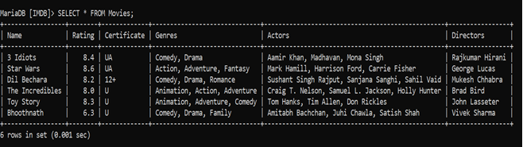

# Movie Detail Extractor
I have made a python script (IMDb.py) which extracts details of any movie from IMDb and dumps into MySQL database.

## Movie Details Extracted
1.	Name
2.	Rating
3.	Certificate
4.	Genres
5.	Actors
6.	Directors

## Features of the Script
- Concise and easy to understand
- Displays proper error messages if any are encountered
-	Stores extracted data in a beautiful format in MySQL table

## Working of the Script
1.	The script first performs an IMDb search for the movie name entered.
2.	From the search results, it extracts the link to the movie webpage on IMDb.
3.	It opens the link for the movie and extracts the JSON of the details of the movie from IMDb source code.
4.	From the JSON, it extracts important details and dumps them into MySQL table.

## Sample Table

